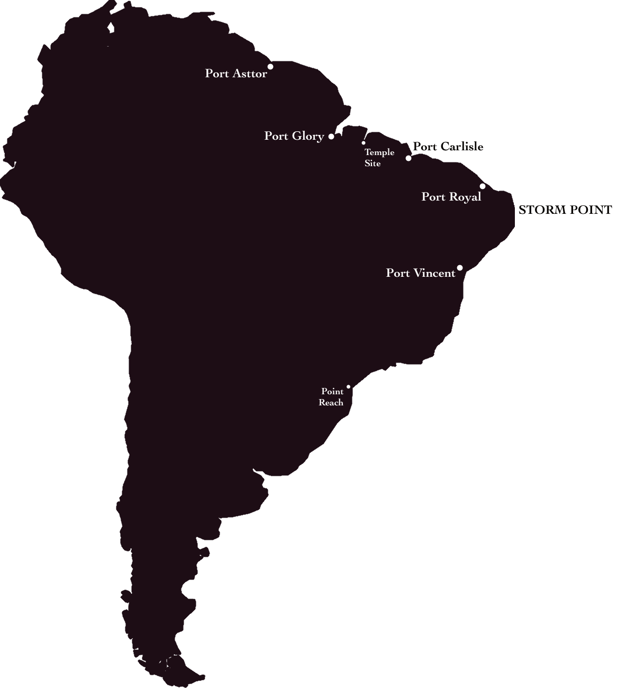

# Act II - A Forest of Secrets

21 years after the vault new mysteries are unearthed half a world away.

## Antremhas Jungles

The rainforest, but bigger. The entirety of this southern continent is covered in lush (and dangerous) forest. The native peoples, known as the Antremhas (though referred to as savages by the colonials) trade with westerners, but can be hostile if found deeper in the forests. Most travelers do not go beyond the beautiful coasts. Many major landmarks (rivers and mountain ranges) have been mapped by explorers, though much of the jungle remains a mystery due to the thick tree cover.

Early explorers were surprised to note that the Antremhas seemed to have access to Looms, or some similar method of extreme physical alteration. Shortly after initial landfall by the Carlisle party (the second major expedition), an abandoned temple was found dug into the sea wall. Of utmost import, however, was the vault found within. Its door was found sundered from within, though with no signs of who, or what, escaped. A small cache of tomes were recovered, though much of the vault’s contents were damaged by the ocean’s advance through its broken entry. The find, however, triggered an explosion of interest for the continent, prompting a new age of colonialism for the Western powers.

New settlements were founded over the next 20 years, the largest being Port Glory. Westward expansion has been continually stymied by the unyielding conditions of work within the jungles, who's very flora and fauna are hostile. The larger enclaves of the Antremhas also see the foreigners as threats, and many small colonial villages disappeared into the night.

## Landmarks:

- Port Asttor
- Port Glory
- The Carlisle Temple Site
- Port Carlisle
- Port Royal
- Storm Point
- Port Vincent
- Point Reach (farthest successful southern expedition)

### Port Asttor

The youngest of the major ports, Port Asttor was founded by the Celts in an attempt to catch up with The Crown’s colonial efforts. Immature, but well funded, the port has grown quickly in its 2 years with a high emphasis on deforestation of the nearby lands for safety and lumber.

### Port Glory

The oldest and largest port city, Port Glory was established roughly 18 years ago as the primary seat of Crown power in the new world. It has become a sprawling city, wrapping along the inland coast, with docks for a score of large ships as well as a decent fishing fleet that provides most of the city’s food.

Since being instated 3 years ago, the provincial governor __Edgar Rothwind__ has cracked down on local crime and piracy along the nearby coasts. Backed by Crown authority, he wields the most power of any single man in the new world. The Crown fleet's flagship, the {{figure out a name}}, has maintained consistent mooring above and east of the Crown's dockside offices, and provides a constant reminder of their presence.

{{sam's character}} had free run of the criminal underworld for many years, and gained a sizable following among the city lowlifes. Since Rothwind's arrival her business has suffered, and other old world criminal powers moved in on the growing city, helped by skills developed in the large cities back across the ocean.

The enigmatic __Mr Finch__ runs much of Capitol Hill, from the docks all the way to High Street. His arrival at port is still much of a mystery, and few claim to have ever met the man in person. Those in the know think he's been around for slightly over a year, and rumors abound linking him to the Crown as some kind of informant. His rise has been too fast and unchallenged by the local constabulary for him to be the normal brand of criminal.